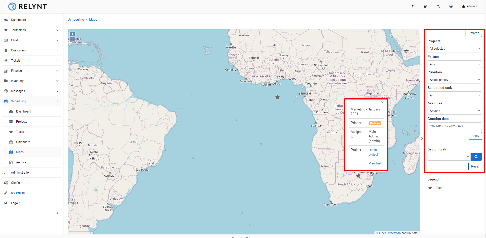

Maps
=====

This section displays the physical location  of all tasks that have physical addresses and geo data recorded, on a map.

The map can be filtered to display tasks by partner, priority, assignee, time period of creation, and/or scheduled/unscheduled/all tasks.

By clicking the task <icon class="image-icon"></icon> icon, brief info about the task will be displayed, with links to the task or project itself.
