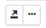
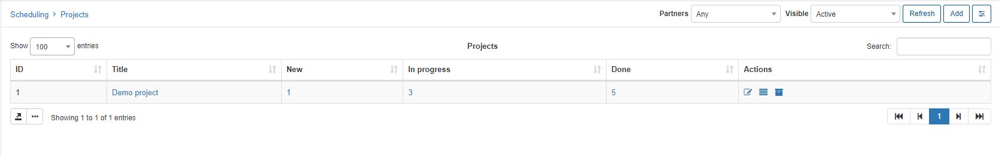
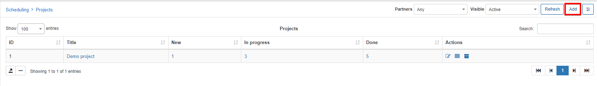
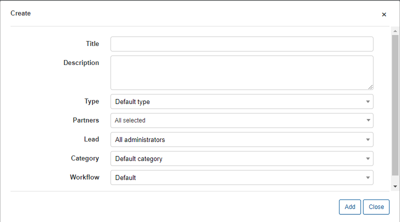
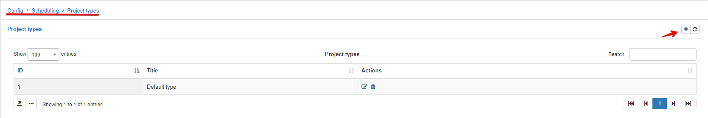
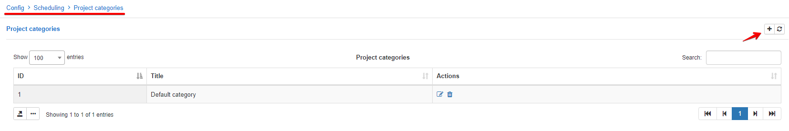
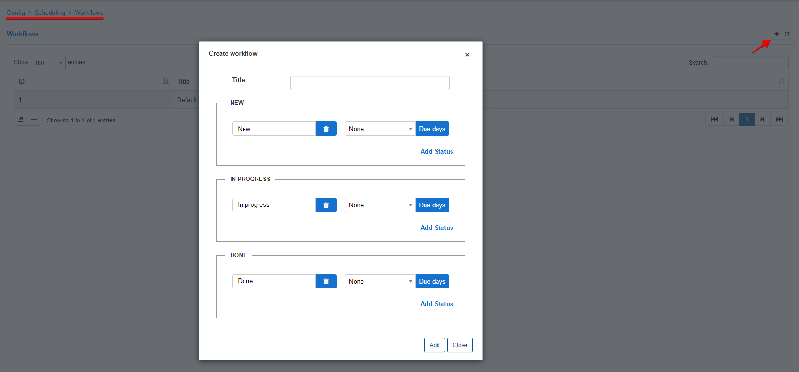

Projects
======
The main menu of the scheduling module, displaying a list of all your projects at hand. With each project representing how many tasks it consists of, in each of its relevant statuses within the Workflow.

**Reminder**: Just like all lists in Splynx, the data displayed can be customized
to your preference by using the breadcrumbs icon at the bottom of each list. 

A new or existing project can be added/reviewed in `Scheduling > Projects`. To add a new project, simply click on the **Add** button in the top right corner.

A window will pop-up with the following options:

* **Title** - project name;
* **Description** - brief description of the project;
* **Type** - the project type, this is a custom option that can be created by an administrator. Project types can be created under `Config > Scheduling > Project types`;

* **Lead** - the lead admin of the project,  
* **Category** - project categories, this is a custom option that can be created by administrator. The categories can be created under `Config > Scheduling > Project categories`;

* **Workflow** - the workflow for project tasks. This is a custom option that can be created/customized by an administrator for different purposes. The workflows can be created under `Config > Scheduling > Workflows`;

Once the project is created we can edit it, view the tasks of the project in a list or Workflow view, or archive the project by using the actions icons <icon class="image-icon"></icon>.
