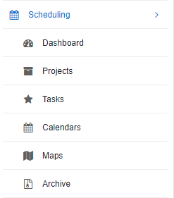

Scheduling
=======

The Relynt scheduling module was specially designed to optimize and simplify project management. As a business, it is vital to be able to manage the tasks of each of your employees and keep up to date with the progress of all activities, up until fulfilment. The scheduling module is a set of convenient tools that when put together, creates a quick and easy, integrated system to manage the processes for efficient fulfilment of service delivery.

 

 
 

* [Archive](scheduling/archive/archive.md)

* [Calendars](scheduling/calendars/calendars.md)

* [Dashboard](scheduling/dashboard/dashboard.md)

* [Maps](scheduling/maps/maps.md)

* [Projects](scheduling/projects/projects.md)

* [Tasks](scheduling/tasks/tasks.md)

* [Workflows](scheduling/workflows/workflows.md)
