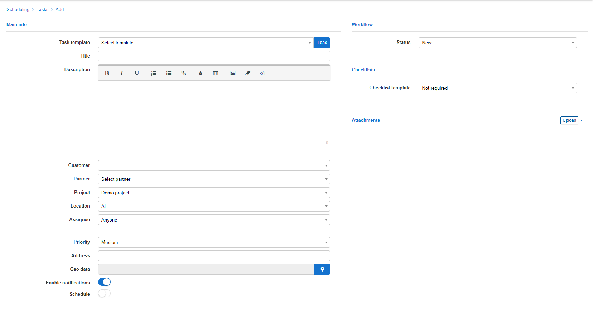

Tasks
======

Every project has various tasks that we can create and assign to a specific administrator. Tasks can be created by clicking the **Add** button under `Scheduling > Tasks` in the list view, or by simply clicking the *=* icon of a status in the Workflow view. *Please note, you first have to select a project to create tasks*

**Table view**:

**Workflow view**:

The tasks displayed can be filtered by a specific criteria with the fields provided.

It is also possible to create the tasks directly from the ticket you are working with by clicking the **Create task** option of the **Actions** button within the ticket.

Upon clicking on create task, you will be presented with the following window:

It is possible to create task templates to optimize the routine/process of adding new tasks. Templates will populate the fields with preset data you have configured for the template. You can create your own templates under `Config > Scheduling > Task templates`.  

*Create task window* includes:
* **Task template** - custom templates for quick task creation;
* **Title** - task name;
* **Description** - description of the task;
* **Customer** - customer related to the task;
* **Partner** - if a customer is selected this field will be auto-filled with the relative partner of the customer
* **Project** - related project;
**Location** - if a customer is selected this field will be auto-filled with the relative location of the customer
* **Assignee** - the responsible person;
* **Priority** - priority of the tasks options are: low, medium, high;
* **Address** - physical address of the task, if a customer is selected this field will be auto-filled with the relative details of the customer;
* **Geo data** - if the geo data is specified, the task will be displayed on the map;
* **Enable notifications** - enable/disable notifications for the task
* **Schedule** - it is possible to set a scheduled time and date for the task;
* **Workflow** - your own workflow. Ex: to do, in progress, done, etc.
* **Checklist** - it is possible to use a custom checklist for various purposes like customer connection, new installation, etc.

Once the task has been created it is possible to edit it by simply clicking on the Task title.

All relevant details of the task can be edited or can simply check the activity log for historical events of the task.

Every task has action buttons that allows you to interact with the task and its integrated features:  

At the bottom of the tasks window you will find the Activities, Comments and Worklog Tabs. It allows you to track all the activities that were performed within the task, check or add to the worklog and task comments.

  
