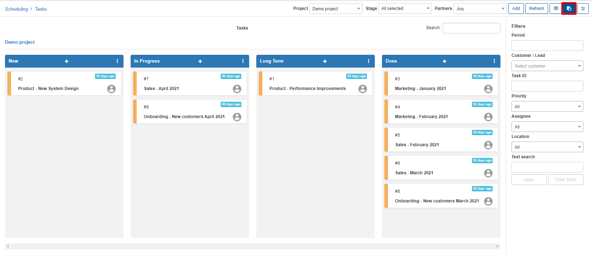
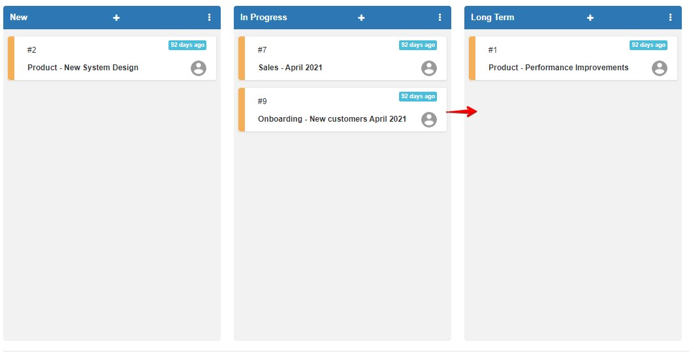
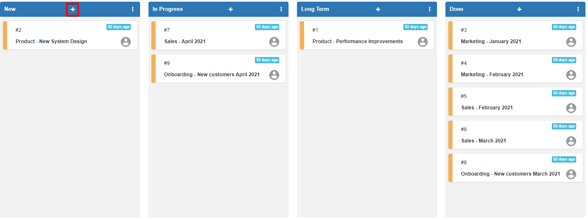
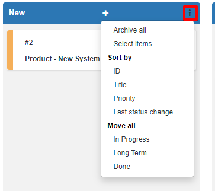

Workflows
=======

Workflows allow you to oversee the project tasks and progress with a visual board interface. To view tasks in the Workflow view simply navigate to `Project (select a project) / View tasks` and simply select the Workflow vie in the top right of the page.

You can change each task's status by dragging it to the needed position on the board and conveniently open any task by simply clicking it.

It is possible to add new tasks in any desired stage of the work flow with the + icon.

You are also able to archive tasks, modify the sorting of tasks or move tasks with the breadcrumbs icon.

